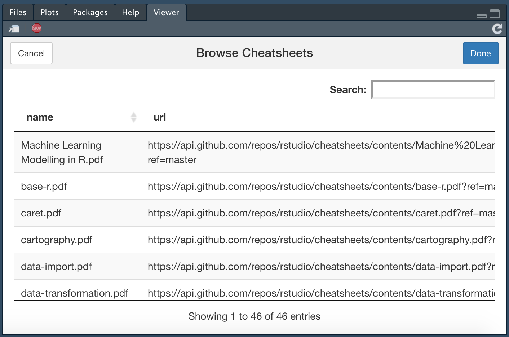

# cheatsheetAddin 📋:An RStudio-Addin to quickly show available cheatsheets.
This package registers itself as an addin and lists all available cheatsheets
when activated. When a cheatsheet is clicked in the list it will open in the local PDF viewer.

## Installation
```r
install.packages('devtools')
devtools::install_github('jansim/cheatsheetAddin')
``

```